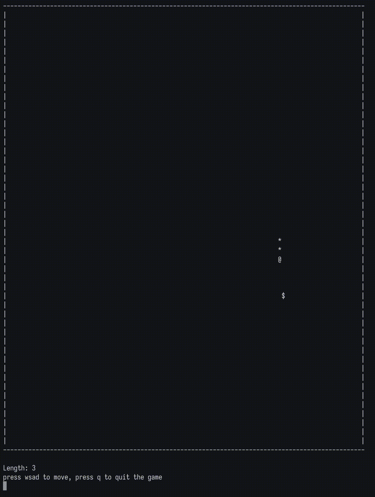

# c-snake-terminal
[](https://opensource.org/licenses/MIT)


**c-snake-terminal** is a classic snake game implemented in C, designed for macOS/Linux environments, running directly in the Terminal/Console.

## Preview


> You may need to adjust the terminal size.

## QuickStart
```bash
git clone https://github.com/xiechunyao/c-snake-terminal.git

cd c-snake-terminal

make snake

./snake
```
## 
